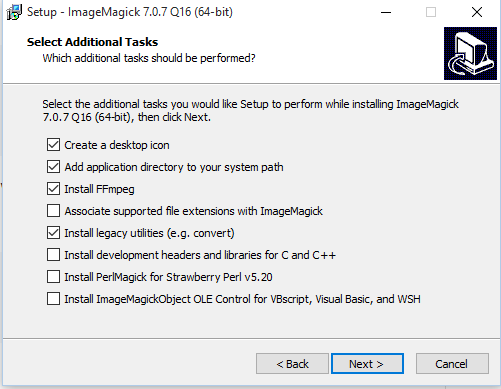

# Installation on a Microsoft Window development machine

## Requirements
Window All-In-One rails installer [Ruby on Rails](http://railsinstaller.org/en) rails >= 5.1.4 + Ruby 2.3.3 + NodeJS
[ImageMagick](http://www.imagemagick.org) for documents processing

Gem file is configured to use postgreSQL, so please install PGQSL window binary
[EDB POSTGRES](https://www.enterprisedb.com/)

If you want to use another DBMS, you will have to change the gem file

### Rails

After having run RailsInstaller, launch a git bash, verify ruby version ``ruby -v``, install Rails ``gem install rails`` and verify the version :
```
$ rails -v
Rails 5.1.5
```
Check you can create a new application named blog ``rails new blog``

The system will create the app files and launch the command ``bundle install`` to fetch some gems

Launch the server with the command ``rails server``. The server should be up on port 3000. Browse the adress http://localhost:3000 in Mozilla.

### ImageMagick

For a more detailed procedure, check https://github.com/thoughtbot/paperclip#requirements

ImageMagick uses two utilities file.exe and convert.exe

You will have to install file.exe from [gnuwin32](http://gnuwin32.sourceforge.net/packages/file.htm)

When you install ImageMagick, don't forget to include the required legacy utilities among which you will find convert.exe



Modify the system and user paths so that they begin with something like C:\Program Files\ImageMagick-7.0.6-Q16\ and C:\Program Files (x86)\GnuWin32.

On windows 10, from the control panel :
``
Security and System > System > Advanced System Parameters > Environment Variables
``

Please note Window has got its own convert utility. Paperclip will not work with the Window convert.exe. ImageMagick's convert.exe should come first
```
$ where convert
c:\Program Files\ImageMagick-7.0.6-Q16\convert.exe
c:\Windows\System32\convert.exe
```
Check if everything is OK in the rails git bash :
```
$ which file
/c/Program Files (x86)/GnuWin32/bin/file
$ which convert
/c/Program Files/ImageMagick-7.0.6-Q16/convert
```

### NodeJS

Install [NodeJS](https://nodejs.org/en/download/)

## Installation
Clone/Unzip/git clone the repository into your local rails directory, for example C:/Sites/. 
Open the resulting app directory in a git bash 
```
$ cd /c/Sites/sharebox
```
Install the required gems ``$ bundle install`` or ``$ bundle update``

Please note that the bcrypt gem needed for devise may malfunction.
To correct, you have to reinstall manually
```
$ gem uninstall bcrypt
$ gem uninstall bcrypt-ruby
$ gem install bcrypt --platform=ruby
```
## database

Modify the \config\database.yml with your database credentials. 
Generally, the postgreSQL Window installer creates a user "postgres" for which you were asked a password during the installation process. 
```
default: &default
  adapter: postgresql
  encoding: unicode
  # For details on connection pooling, see Rails configuration guide
  # http://guides.rubyonrails.org/configuring.html#database-pooling
  pool: <%= ENV.fetch("RAILS_MAX_THREADS") { 5 } %>
  username: postgres
  password: your_pass
  host: localhost
```

Create the database and the tables
```
$ rake db:create
$ rails db:migrate
```
To create the database structure and the tables, you don't have to run all the migrations from scratch :
```
$ rails db:schema:load
```
## launch the server in development mode

#### First option
Edit the set_env_var.bat file, fill it with your personal credentials and run this bat file from the main DOS shell. It will fix the environment details in all subsequent shells such as git bash or window power shell. You can start the server from a git bash with the classic method :
```
$ rails server
```

#### Second option 
On Windows, this second option may permit to override specific problems related to environment variables beginning with /. Edit the .env file and fill it with your personal credentials. Install [node-foreman](https://github.com/strongloop/node-foreman) and start the server from a git bash with the following command :
```
$ nf -p 3000 start -s -j Procfile_dev
```

### Use Amazon S3
You may encounter difficulties due to some SSL defaults on your development machine.

To override, create a file /config/initializers/paperclip.rb with the following command
```
OpenSSL::SSL::VERIFY_PEER = OpenSSL::SSL::VERIFY_NONE
```
Caution : only for a development purpose; not suitable for a production server !

# update to the lastest ruby version

last versions of sharebox/colibri may not work with 5.1.4 and ruby 2.3.3

Check https://rubyinstaller.org/downloads/ and install the version of ruby of your choice

It can be https://github.com/oneclick/rubyinstaller2/releases/download/RubyInstaller-2.6.3-1/rubyinstaller-2.6.3-1-x64.exe

The installer will ask you if you want to install the MSYS2 tools (Minimalist GNU for Windows) -> choose option 3

launch a git bash and check your bundle version :
```
bundle --version
Bundler version 1.17.2
```
update bundle :
```
gem update bundler
```
the update command should render the following output :
```
Updating installed gems
Updating bundler
Fetching bundler-2.0.2.gem
Successfully installed bundler-2.0.2
Parsing documentation for bundler-2.0.2
Installing ri documentation for bundler-2.0.2
Installing darkfish documentation for bundler-2.0.2
Done installing documentation for bundler after 11 seconds
Parsing documentation for bundler-2.0.2
Done installing documentation for bundler after 3 seconds
Gems updated: bundler
```
make a verification :
```
bundle --version
Bundler version 2.0.2
```
clone the repo :
```
git clone https://github.com/alexandrecuer/sharebox.git
cd sharebox
```
edit the Gemfile with the editor of yur choice and change the lines defining the versions of ruby and pg gems :
```
ruby '2.6.3'
gem 'pg', '~> 1.1.4'
```
for the postgresql gem, check the last version on the rubygems website. At the date of september 2019, it should be :

https://rubygems.org/gems/pg/versions/1.1.4-x86-mingw32

install the gems :
```
bundle install
```
Your Gemfile.lock should be fine

Modify your config/database.yml with your pgsql password, create/migrate the base if not already done and start rails :
```
rails server
```


